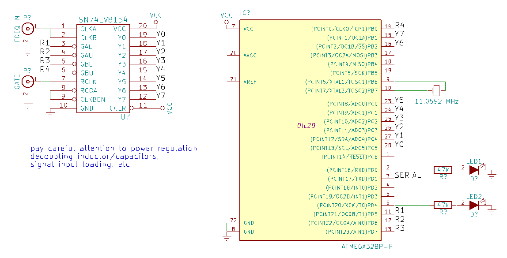
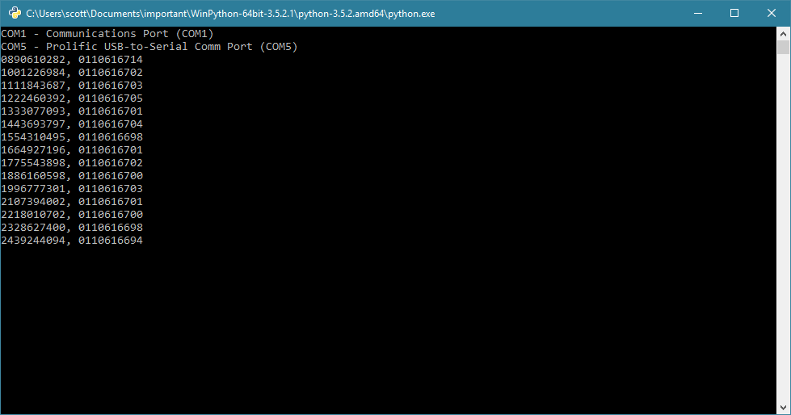
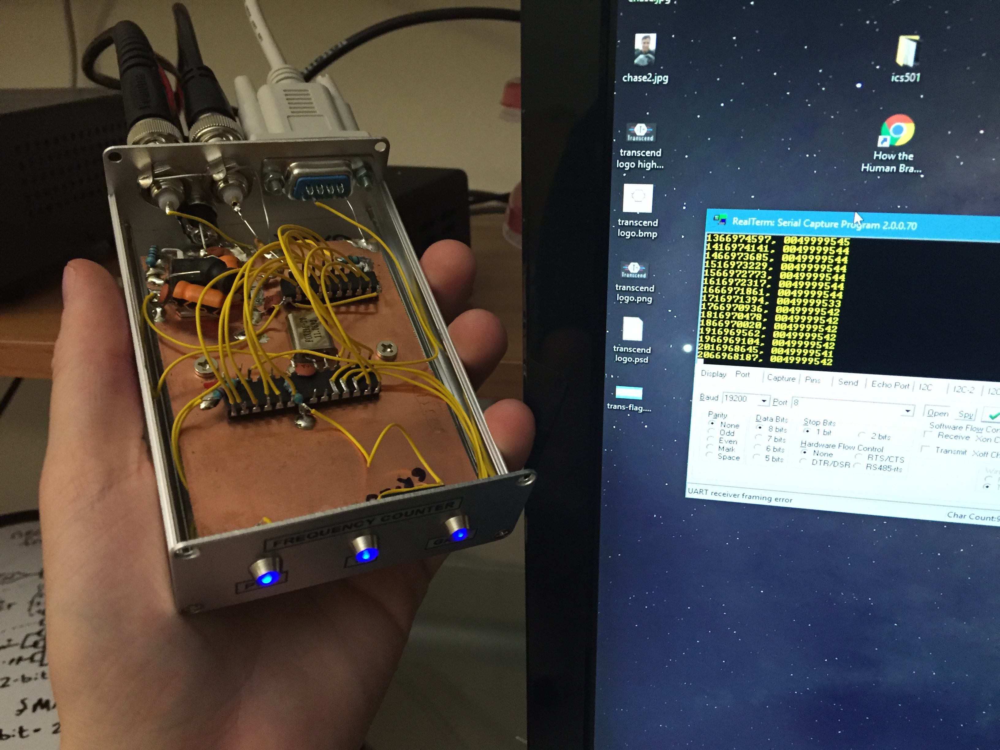

# Newer Project - USB Counter with SN74lV8154
This project became its own GitHub repository:
* **https://github.com/swharden/USB-Counter** 👈 improved schematics and notes

# Original Project - SN74lV8154 AVR counter
This folder describes the design described on the original project page: http://www.swharden.com/wp/2016-09-05-vhf-frequency-counter-with-pc-interface/

The sn74lv8154 is a dual 16-bit counter than can be configured to act as a 32-bit counter. Although the datasheet doesn't report functionality at VHF frequencies, in my tests it works at least at 100MHz. The way I operate it is as a frequency counter with a gate. I'm measuring unknown frequencies with 1 pulse per second gate (from a GPS unit).

* Datasheet: http://www.ti.com/lit/ds/symlink/sn74lv8154.pdf

This program measures frequency with the AVR and outputs frequency (counts) to a computer via the serial port. Included is a barebones python script to display these frequency counts.

***WARNING:*** This schematic does not show [proper termination of the feed line](https://en.wikipedia.org/wiki/Electrical_termination). \
If using 50 Ohm coax, add a 50 Ohm resister between pin 1 and ground. _Thanks freemo_ ([#2](https://github.com/swharden/AVR-projects/issues/2))

_note: My tests on a breadboard showed this setup easily counts VHF frequencies over 100MHz (screenshot below). However, when I built it in an enclosure, it struggled to measure frequencies above 70MHz. It works well at 50MHz. I suspect this is because the signal I'm using doesn't travel well through 50 Ohm coax, but nontheless note that this is somewhat sketchy at VHF frequencies. Here it is clocking a canned 50MHz oscillator._
