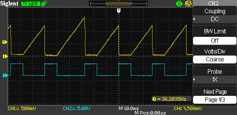
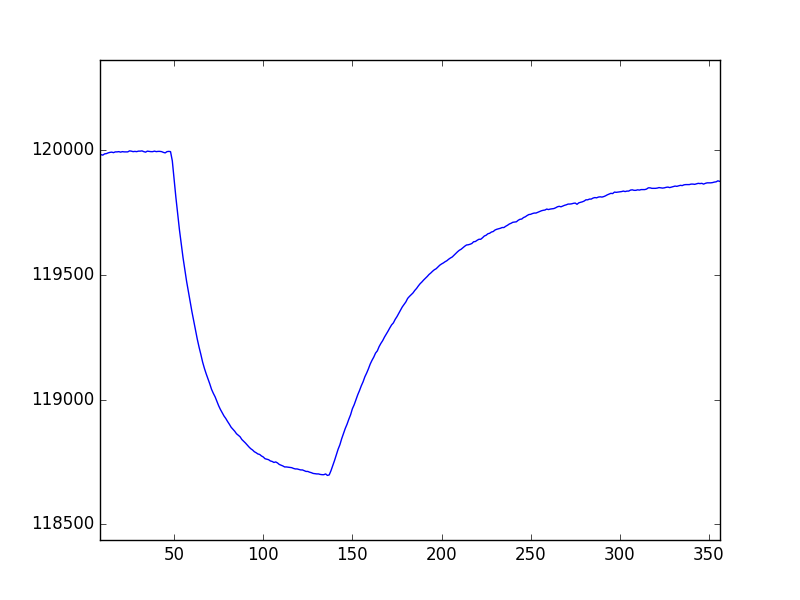

# Capacitor Charge Voltage Measurement
The idea behind this project is to measure a voltage by timing how long it takes to linearly charge a capacitor (using constant current charging) from 0V to the test voltage. This time is directly porportional to the test voltage. In this example, the AVR's internal comparator is utilized. Voltage is output through the serial port (TX pin)

# Project Page:
* http://www.swharden.com/wp/2016-09-09-adding-adc-to-microcontrollers-without-adc

Build this circuit to charge a capacitor at a constant rate (with reset)

This is the output on my scope

Using an LM335 temperature sensor, these are the values I get out when I touch the sensor then let it cool again
