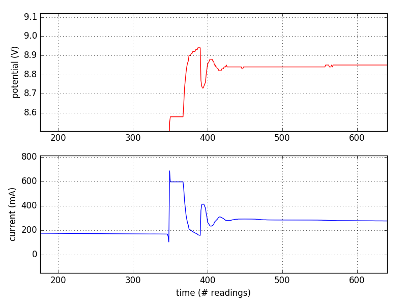

#  Bluetooth Interface for Panel Current/Ammeter
This code uses an ATMega328 to sample the multiplexed display of a cheap eBay current/volt meter and send its reading (via UART Tx pin) to a serial port (which in this case is attached to a bluetooth serial adapter).

## Project Page:
* http://www.swharden.com/wp/2016-09-19-hacking-a-cheap-…oth-pc-interface/

## Notes:

