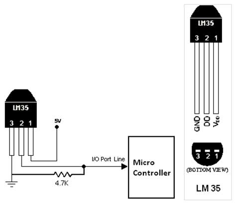
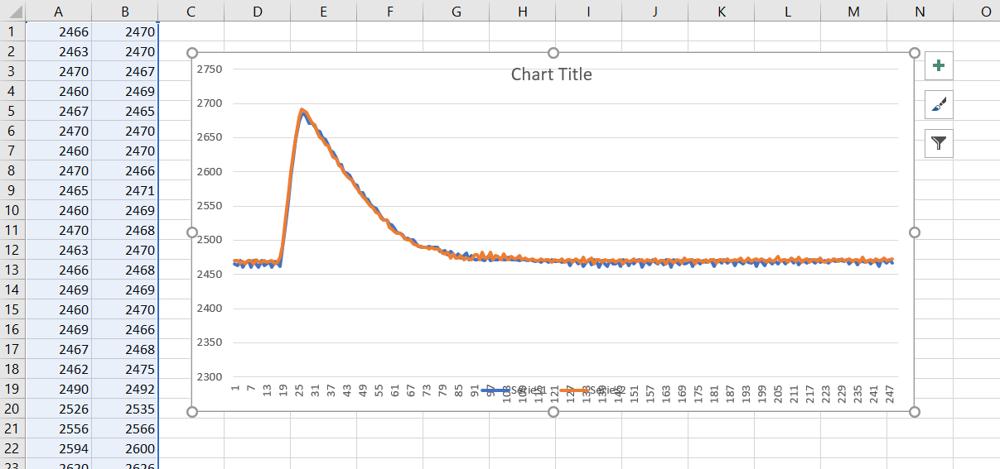

# Read ADC with ATMega328 (with serial output)
**This project reads an analog voltage on PC5 (ADC5, pin28) and outputs its value via USART (serial).** I use a USB FT232 breakout board to capture the output and log it on my PC. The voltage I'm measuring is the output of a LM35 temperature sensor. 25.3 C would be output as 0.253 V. Therefore, the internal 1.1V reference lets me measure up to 110C (230F) in 110/(2^10)=0.1C increments.

|
---|---

## ADC using free running mode
This will cause the ADC to continuously run such that the current analog value can always be obtained by reading the `ADC` variable. The full demo of this simple ADC method exists in [main.c](main.c).
```C
void init_ADC(){	
	// make ADC run continuously (free running mode)
	//ADMUX|=_BV(REFS1)|_BV(REFS0); // internal 1.1V reference with cap on AREF pin (leave blank for AREF)
	ADMUX|=0b0101; // read from ADC5 (PC5, pin 28)
	ADCSRA|=_BV(ADEN);// ADC enable
	ADCSRA|=_BV(ADPS1)|_BV(ADPS0); // prescale by 8	(make sure CK/prescale is 50kHz-200kHz)
	ADCSRA |= _BV(ADATE); // ADC auto trigger enable (enable for free running mode)
	ADCSRA |= _BV(ADSC); // start the first conversion, and go forever if free running mode
}
```

## ADC using noise reduction mode
ADC performance can be slightly enhanced by putting the microcontroller to sleep (idle mode) while making the ADC read. In this configuration the ADC can not be in in free running mode. It can be polled can be polled manually by setting the ADSC bit high, but is also polled automatically when the ADC enters idle mode. Enabeling an interrupt on ADC measurement completion can wake up the microcontroller when the ADC value is ready. This means you have to enable interrupts and have the interrupt vector ready to go (as shown in [main_both.c](main_both.c)).

**Setting up the ADC**
```C
void init_ADC(){	
	// prepare the ADC to run in ADC Noise Reduction mode (automatically when sleep happens)
	ADMUX|=_BV(REFS1)|_BV(REFS0); // internal 1.1V reference with cap on AREF pin (leave blank for AREF)
	ADMUX|=0b0101; // read from ADC5 (PC5, pin 28)
	ADCSRA|=_BV(ADEN);// ADC enable
	ADCSRA|=_BV(ADIE); // when sei(), ADC conversion complete interrupt is activated
	ADCSRA|=_BV(ADPS1)|_BV(ADPS0); // prescale by 8	(make sure CK/prescale is 50kHz-200kHz)
}
```

**Making a measurement**
```C
int ADC_read_quiet(){
    // enter sleep mode, make an ADC read, wake up, and return the read.
    set_sleep_mode(SLEEP_MODE_ADC); // set sleep mode to this
    sleep_enable(); // enable sleep
    sleep_mode(); // run the sleep mode (this starts an ADC read like ADCSRA |= (1<<ADSC) does)
    // ...when conversion is complete, ADC_vect is called, then we wake up and continue...
    sleep_disable(); // disable sleep
}
```

## Notes
- I had a _extremely_ volatile ADC readings no matter what I did. I added filter caps out the wazoo and it never improved! I finally realized it was because my power supply ground was not grounded to my PC ground. I think my USB hub's ground was floating too. All those various floating grounds were causing wonky signals. Once well-grounded (with a quieter, linear power supply too), it improved immedaitely.
- I record data using RealTerm (it has a capture option) and can quickly plot it in Excel
- don't forget the resistor to ground on the LM35, or a series resistor between the output pin and the MCU for stable recordings
