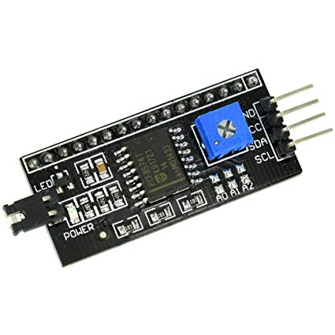
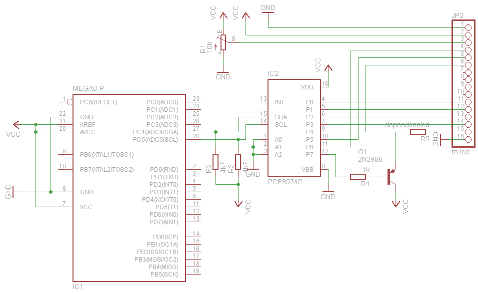

# AVR Example using an I2C LCD backpack module

Code here demonstrates how to use a [pcf8574](http://www.ti.com/lit/ds/symlink/pcf8574.pdf)-based I2C LCD backpack to drive a hd44780-style LCD.

I do this using Davide Gironi's lcdpcf8574 library. See [src/main.c](src/main.c)

.jpeg)

