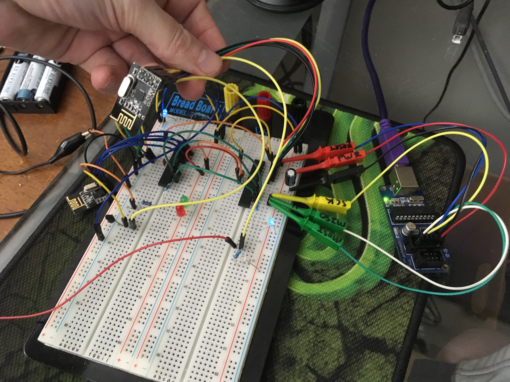
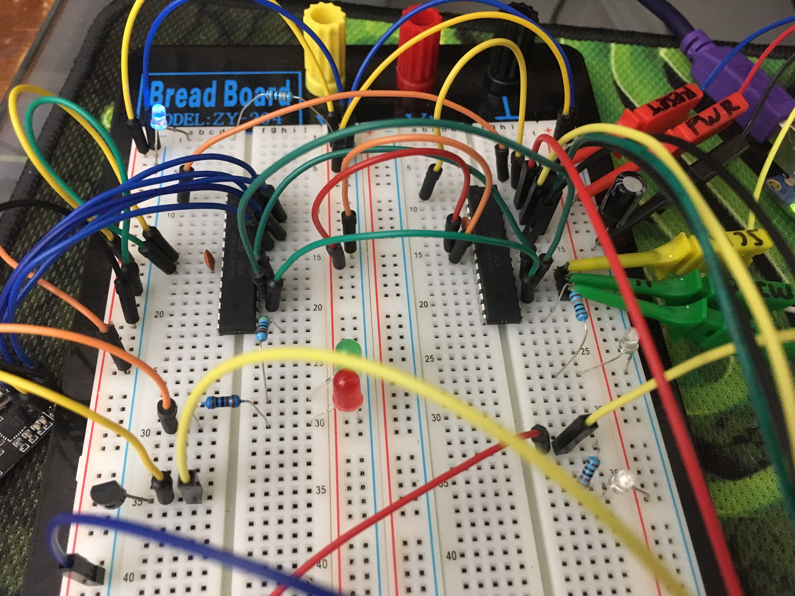

# Getting nrf24l01 / nrf24l01+ Running on ATMega328P
I got a lot of benefit from [kehribar's nrf24L01_plus project](kehribar/nrf24L01_plus) and made a boilerplate project to allow 2 ATMega328P chips to communicate bidirectionally each with their own radio.

## Code Examples
Although the full code is in the src folder, the important parts are shown here. This code increments a variable 1->5 and transmits it. The receiver reads this variable and blinks an LED that number of times.

### Customization of pins
This is done in [radioPinFunctions.c](src/radioPinFunctions.c) but it's easy:
```C
#define RF_DDR  DDRC
#define RF_PORT PORTC
#define RF_PIN  PINC
```

Then just know which pins of those ports are used by reading:
```C
set_bit(RF_DDR,0); // CE output
set_bit(RF_DDR,1); // CSN output
set_bit(RF_DDR,2); // SCK output
set_bit(RF_DDR,3); // MOSI output
clr_bit(RF_DDR,4); // MISO input
```

### Setup
This is common to the RX and to the TX.

```C
nrf24_init();    
nrf24_config(2,4); // Channel #2 , payload length: 4

nrf24_tx_address(address_B);
nrf24_rx_address(address_A);    
```

### Transmitter code
```C
while(1)
{
	// make the first bit of data_array change every time
	data_array[0]=data_array[0]+1;
	if (data_array[0]>5) data_array[0]=1;

	// sent the data array
	nrf24_send(data_array);        
	while(nrf24_isSending());        

	// do things based on if transmission worked
	temp = nrf24_lastMessageStatus();
	if(temp == NRF24_TRANSMISSON_OK) {/* */}
	else if(temp == NRF24_MESSAGE_LOST) {/* */}

	// wait a while before trying again
	LEDblink();
	_delay_ms(1000);
}
```

### Receiver code
```
while(1)
{              
	if(nrf24_dataReady())
	{
		nrf24_getData(data_array);    
		char i=data_array[0];
		while (i-->0) LEDblink();
	}
}
```

### Test Setup




## Pins


* VCC (power) - requires 3.3v (not 5V!)
* CE (chip enable) - controls TX vs RX. Connect to any IO pin [high vs low??????]
* CSN (chip select) - always high, but pull low to send a SPI command to the nRF
* SCK (serial clock) - connect to SCK MCU pin
* MOSI (master output slave input) - connect to MOSI MCU pin [output]
* MISO (master input slave output) - connect to MISO MCU pin [input]
* IRQ (interrupt request) - not required, but could be toggled on successful transfers.

http://www.tinkerer.eu/AVRLib/nRF24L01/

## Links
* https://github.com/kehribar/nrf24L01_plus
* http://gizmosnack.blogspot.com/2013/04/tutorial-nrf24l01-and-avr.html
* https://github.com/antoineleclair/avr-nrf24l01
* https://github.com/kehribar/nrf24L01_plus
* https://www.insidegadgets.com/2012/08/22/using-the-nrf24l01-wireless-module/
* https://www.theengineeringprojects.com/2015/07/interfacing-arduino-nrf24l01.html
* http://arduinotehniq.blogspot.com/2016/01/nrf24l01-radio-module-and-arduino.html
* http://www.deviceplus.com/how-tos/arduino-guide/nrf24l01-rf-module-tutorial/
* http://forum.arduino.cc/index.php?topic=290701.0
* http://www.tinkerer.eu/AVRLib/nRF24L01/