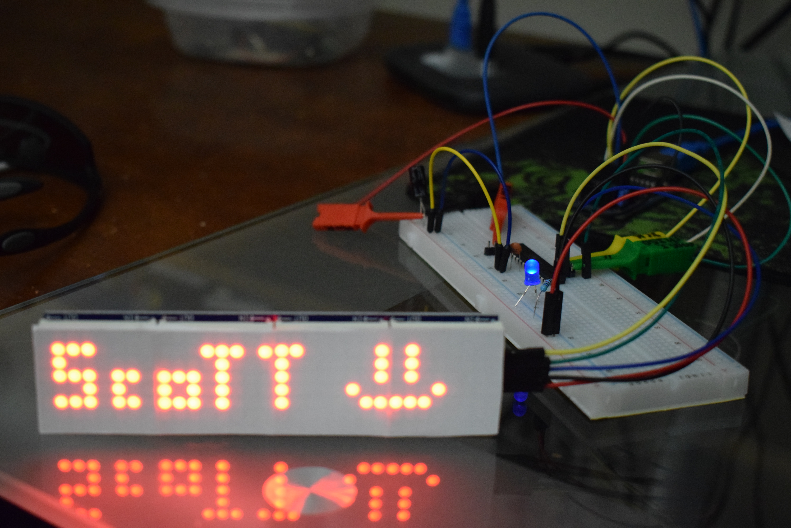
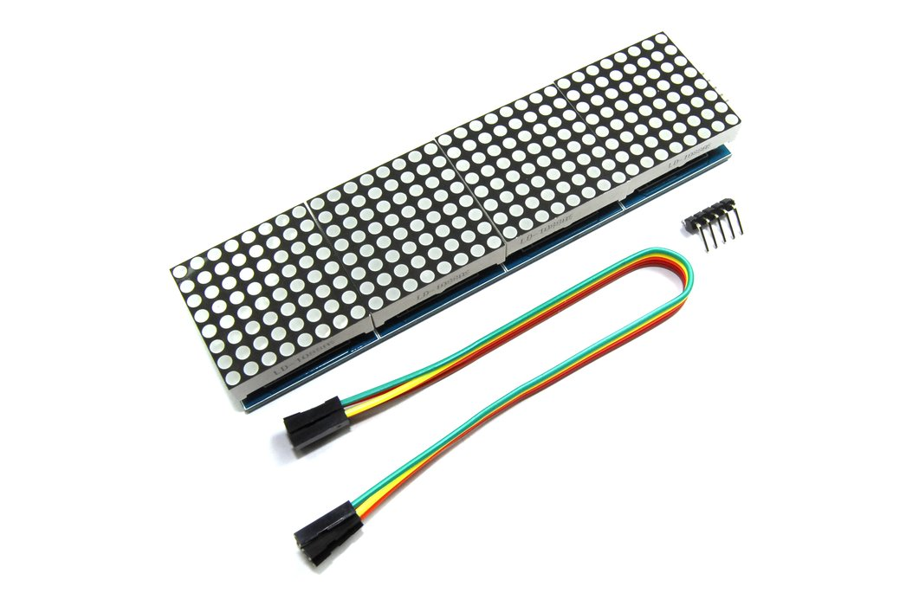

# MAX7219 LED Matrix

This folder contains demo files showing how to get an AVR (ATMega328P) to control a MAX7219-based LED matrix I purchased on eBay.

*[MAX7219 datasheet](https://datasheets.maximintegrated.com/en/ds/MAX7219-MAX7221.pdf)

