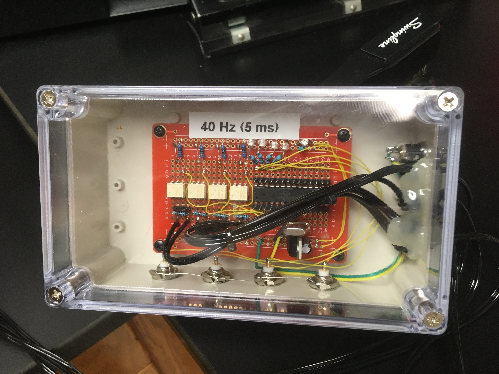
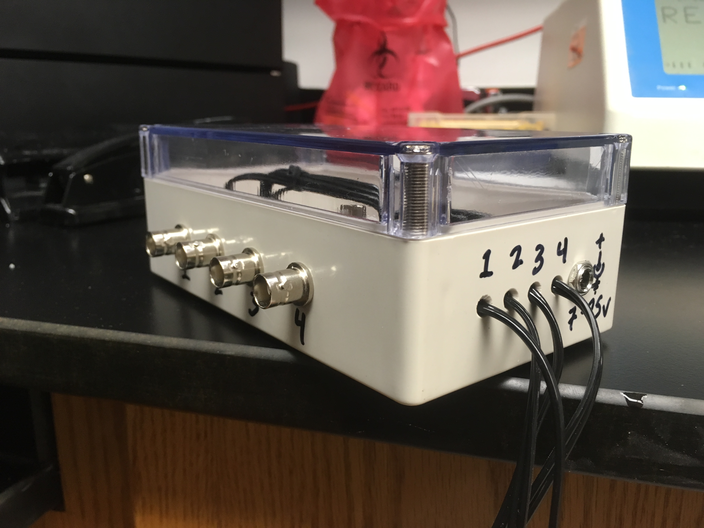

# 4-Channel TTL Laser Controller
* This project describes a laser controller which takes a computer-controlled 28V differential input signal (slow, usually 1Hz) and outputs modulated TTL square waves (40Hz of 5ms pulses)
  * The microcontroller is an [ATMega328P](http://ww1.microchip.com/downloads/en/DeviceDoc/Atmel-7810-Automotive-Microcontrollers-ATmega328P_Datasheet.pdf)
  * The code is [main.c](main.c) (compiled with AVR-GCC)
  * The input is -28V and 0V with respect to ground (!)
  * The [H11A1 opto-isolator](https://www.vishay.com/docs/83730/h11a1.pdf) converts differential input signals to TTL
  * The input cable uses a [1mm keyhole connector](http://www.plastics1.com/Catalog.php?FILTER_CLEAR&FILTER_F10=Medical&FILTER_F0=Connectors&FILTER_F1=Touchproof&FILTER_F2=1mm)
* Output is TTL pulses are delivered through BNC connectors
* An external crystal is used to maximize stability in the time domain

## Changing the Waveform
* Hardware allows for the 4 channels to have 4 different waveforms (although the software is not currently written that way)
* The present configuration is for a 25ms period (40 Hz) of 5 ms pulses
* Edit [main.c](main.c) to change the waveform as needed
* I use a [USBtinyISP](https://www.amazon.com/s?k=usbtinyisp) to program the chip

```c
// set these to control the waveform
const char msHigh = 5;
const char msLow = 20;
```

## Hardware
* [ABS junction box with transparent cover](https://www.amazon.com/uxcell-200mmx120mmx113mm-Universal-Enclosure-Transparent/dp/B071FKFLKZ/) (6.2" x 3.5" x 2.3")
* [solderable breadboard](https://www.amazon.com/Gikfun-Solder-able-Breadboard-Plated-Arduino/dp/B071R3BFNL/)



