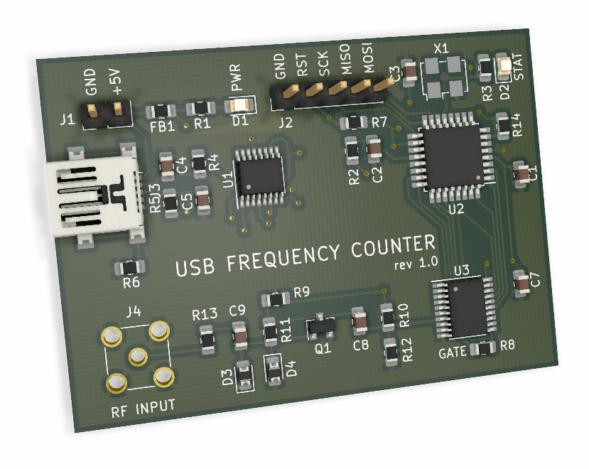
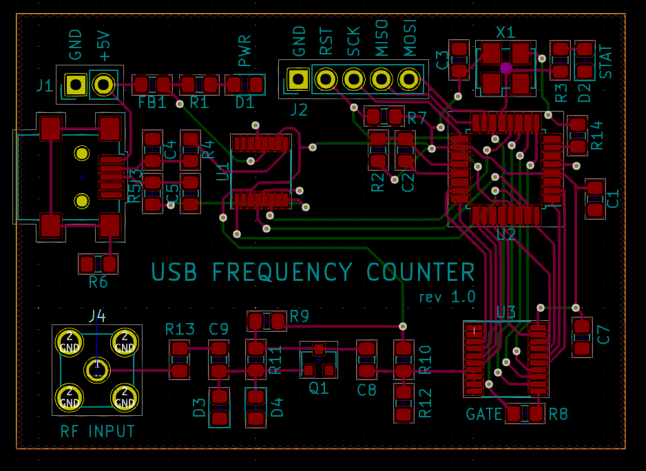
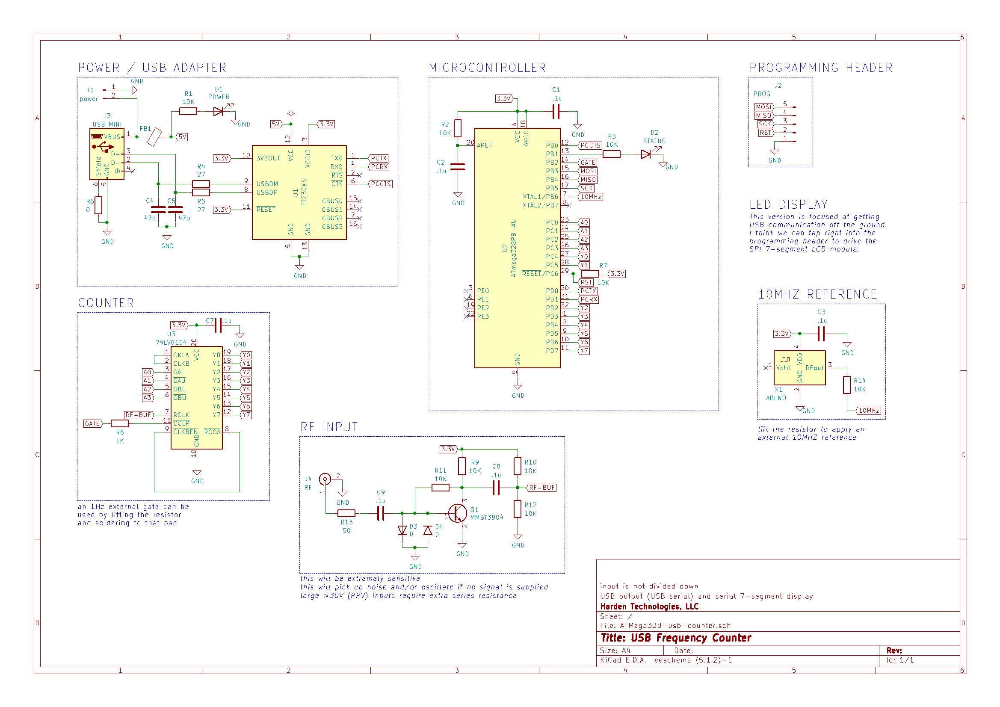
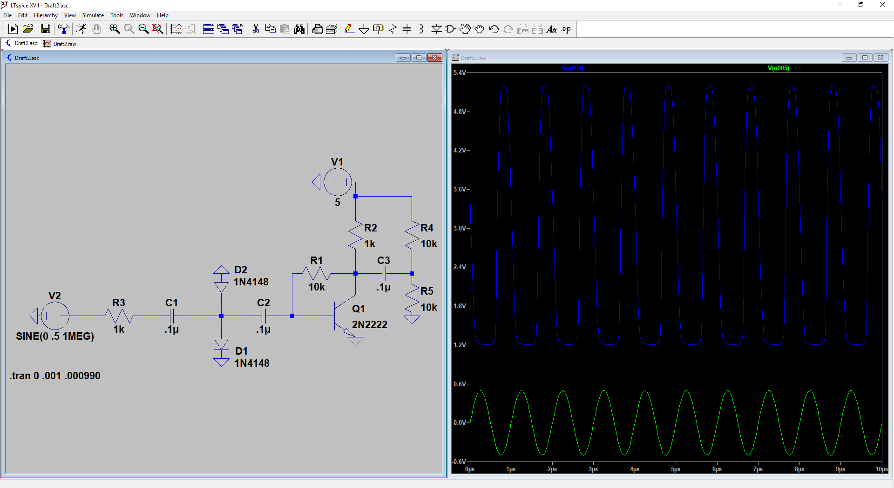

# USB Frequency Counter

This project contains the design and microcontroller code for a USB logging frequency counter. The entire project is open source (open software / open hardware). This project developed from a discussion that started [here](https://github.com/swharden/AVR-projects/issues/1).

The current PCB fabrication cost at OSHPark is $17.40 for 3 ($5.80 each)

### PCB

### Schematic
See Rev2 notes below for thoughts regarding changing resistor values for the front-end

### Simulated Front-End (200 mV PPV input signal)

## Features
* USB connection allows PC monitoring/logging of frequency
* USB connection not required
  * can be alternatively powered through the 5V pins
  * a SPI-driven 7-segment led module can display frequency
* can use external 10MHz reference
  * don't populate X1, C3, or R14
  * apply 10MHz TTL to the R14 pad
* can use external gate
  * don't populate R8
  * apply 1Hz TTL to the R8 pad
* input signal is amplified and protected (up to 30V)
* no prescaling of input signal
  * every single cycle is counted over extended periods of time
  * cycles not counted in one gate tick roll-over to the next

## Components
* all passives are 0805 (~$1)
* 10MHz TCXO
  * [2.5 PPM 3.3V oscillator](https://www.mouser.com/ProductDetail/Fox/FOX924B-10000?qs=sGAEpiMZZMt8oz%2FHeiymAOqzUXC3weGFrHcwaz7vvYI%3D) ($2.35)
  * [0.2 PPM](https://www.mouser.com/ProductDetail/Murata-Electronics/XTCLH10M000THJA0P0?qs=sGAEpiMZZMt8oz%2FHeiymAP2I3XxjUzcDnJXTALencTGO8W9AcI4jWQ%3D%3D) alternative ($9.24)
* [SN74LV8154](https://www.mouser.com/ProductDetail/Texas-Instruments/SN74LV8154PWR?qs=sGAEpiMZZMtdY2G%252BSI3N4aQvQNXOTGN6Ghdjz%252BkScFE%3D) ($0.99) TSSOP-20
* [FT230XS-R](https://www.mouser.com/ProductDetail/FTDI/FT230XS-R?qs=sGAEpiMZZMtv%252Bwxsgy%2FhiIaF6qCroMVR1i2pEQA5UpU%3D) ($2.04) SSOP-16
* [ATMega328](https://www.mouser.com/ProductDetail/Microchip-Technology-Atmel/ATMEGA328PB-AU?qs=sGAEpiMZZMvc81WFyF5EdrSRAEYMYvHlMc95YQj%2FArE%3D) ($1.38)
* [mini-USB jack](https://www.mouser.com/ProductDetail/CUI/UJ2-MBH-1-SMT-TR?qs=sGAEpiMZZMu3xu3GWjvQiLfiCTO8RP%252Bk%252BIiwpoT5qew%3D) ($0.49)
* [SMA connector](https://www.mouser.com/ProductDetail/LPRS/SMA-CONNECTOR?qs=sGAEpiMZZMuLQf%252BEuFsOrkd7M7rmHNHidLMZ%2Ftb%252B0T1YCJLScw0qLA%3D%3D) ($1.08)

Total is ~$10

## Changes for Rev2
* add pins to connect a SPI-driven 7-segment display like [this](https://www.amazon.com/dp/B07CL2YNJQ)
  * Make sure the MCU code is working for this first
  * You may be able to use PE0-3 (pins 3, 6, 19, and 22)
* make PCB smaller (there's lots of wasted space currently)
* add mounting screw holes