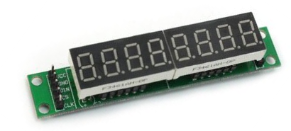
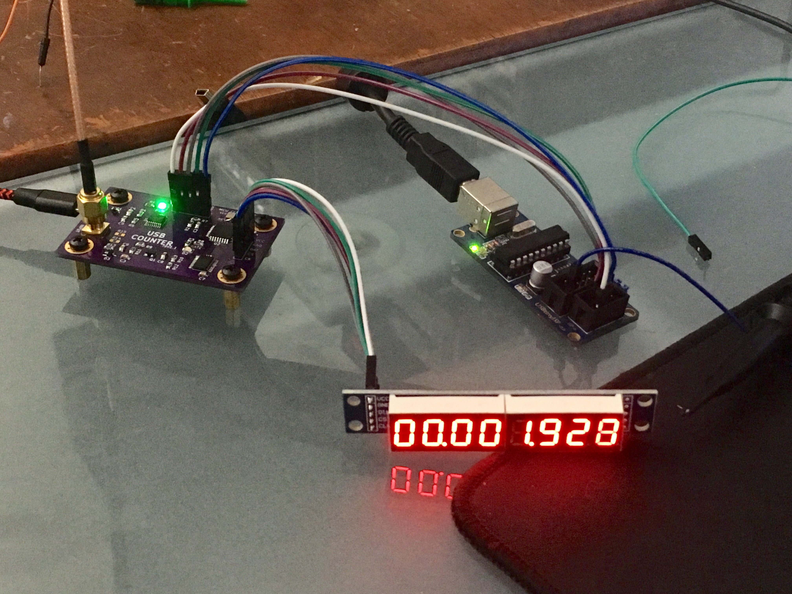
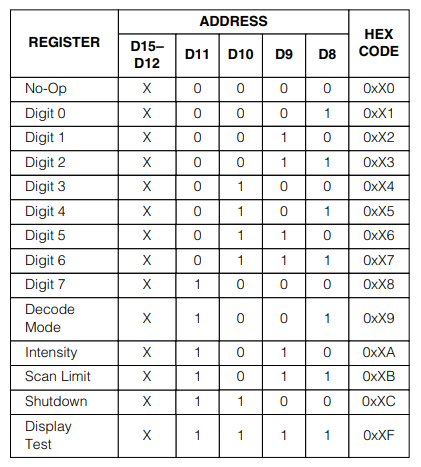

# ATMega328 7-Segment Display Module

This project documents how to drive max7219 7-segment display modules with an ATMega328. These display modules are common and inexpensive ([about $4](https://www.amazon.com/s?k=max7219+segment&ref=nb_sb_noss_2)). They are SPI-driven (around a [MAX7219](https://datasheets.maximintegrated.com/en/ds/MAX7219-MAX7221.pdf)) and can be chained together to connect many displays to a single set of lines.

<p align='center'>



</p>

## Wiring

Display pin | MCU pin
---|---
VCC | +5V
GND | GND
DIN (data in) | MOSI (master out)
CS (chip select) | PB2 (whatever)
CLK (clock) | SCK (clock)



## Code
A full example is [main.c](main.c). Here are the highlights.

### MAX7219 Display Register Map
To program the MAX7219 send pairs of SPI bytes. Each pair is an address and a value.


### Initialize SPI master on the ATMega328
```c
void SpiInitialize(void)
{
	DDRB |= (1 << PB5);  // set SCK as output
	DDRB |= (1 << PB3);  // set MOSI as output
	DDRB |= (1 << PB2);  // set CS as output
	PORTB |= (1 << PB2); // set CS high

	SPCR |= (1 << SPE);  // enable SPI
	SPCR |= (1 << MSTR); // this device is SPI master
	SPCR |= (1 << SPR0); // clock prescale osc/16
}
```

### Send a character with SPI
```c
void SpiSend(unsigned char data)
{
	SPDR = data;
	while (!(SPSR & (1 << SPIF)))
	{
	};
}
```

### Send a command to the display
Commands are always paired: address, value
```c
void DisplaySendCommand(uint8_t address, uint8_t data)
{
	PORTB &= ~(1 << PB2); // set CS low
	SpiSend(address);
	SpiSend(data);
	PORTB |= (1 << PB2); // set CS high
}
```

### Initialize the display module
```c

void DisplayInitialize()
{
	DisplaySendCommand(0x0C, 0x01); // shutdown mode: normal operation
	DisplaySendCommand(0x09, 0xff); // decode mode: BCD for all digits
	DisplaySendCommand(0x0A, 0x0f); // intensity: brightest (last byte)
	DisplaySendCommand(0x0B, 0x07); // display size: max character address
}
```

### Setting display digits
Assign to addresses 1-8 with a number. The lowest four bytes control the value of the digit. The upper four bytes control whether a decimal point is added.

```c
void DisplayClear()
{
	for (int i = 1; i <= 8; i++)
		DisplaySendCommand(i, 0x0F);
}
```

```c
void DisplayNumber(long number)
{
	for (int i = 1; i <= 8; i++)
	{
		char thisDigit = number % 10;
		if (i == 4)
			thisDigit |= 0xf0; // add decimal point
		if (i == 7)
			thisDigit |= 0xf0; // add decimal point
		DisplaySendCommand(i, thisDigit);
		number /= 10;
	}
}
```