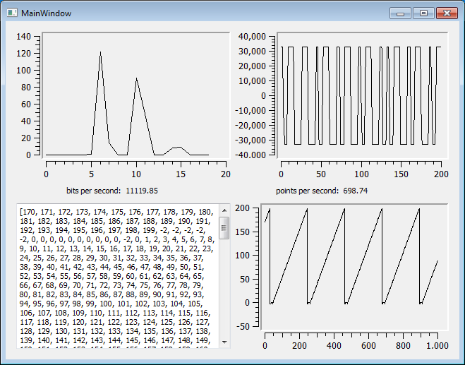
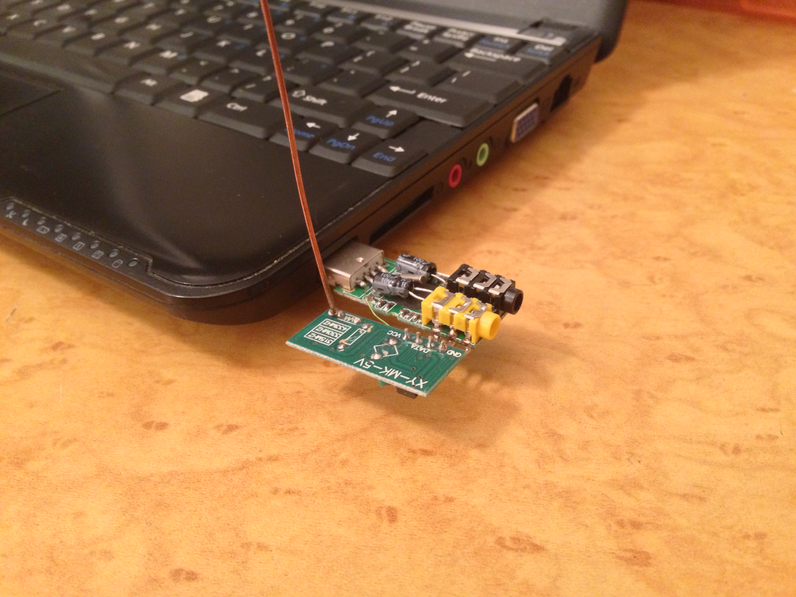

# SH RFP

This project is abandonware, but a "Scott Harden Radio Frequency Protocol" to use a frequency-shift-keying RF module to send pulses of varied length from a microcontroller to a PC's sound card where a Python program listens to the microphone device and decodes the pulses as data.

Props for creativity 2013 Scott!

