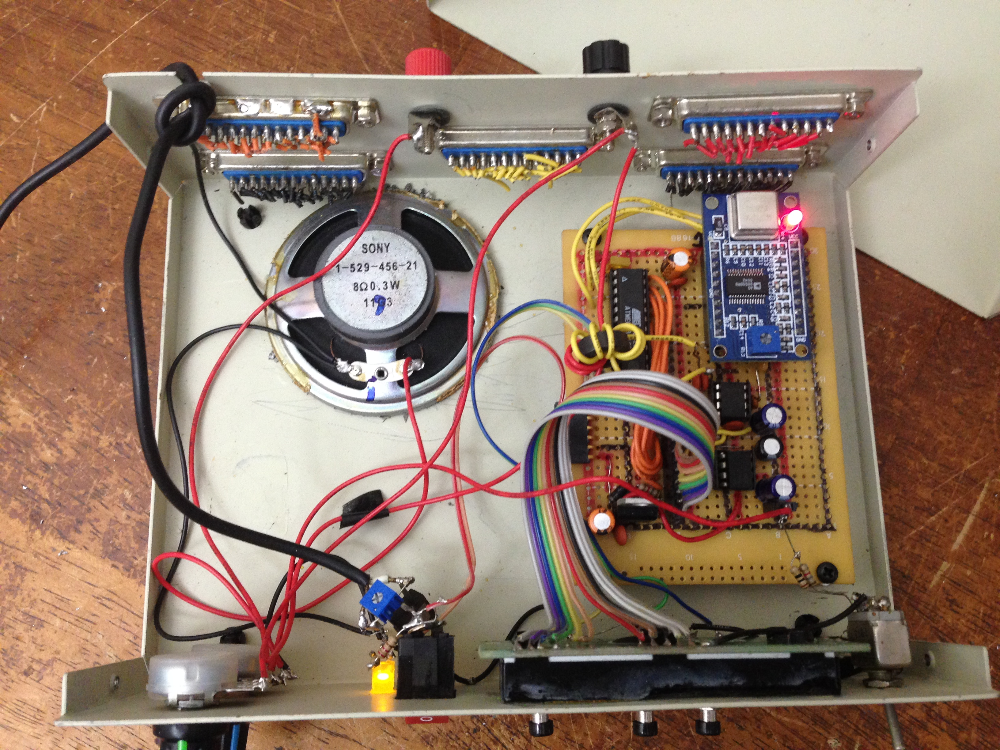
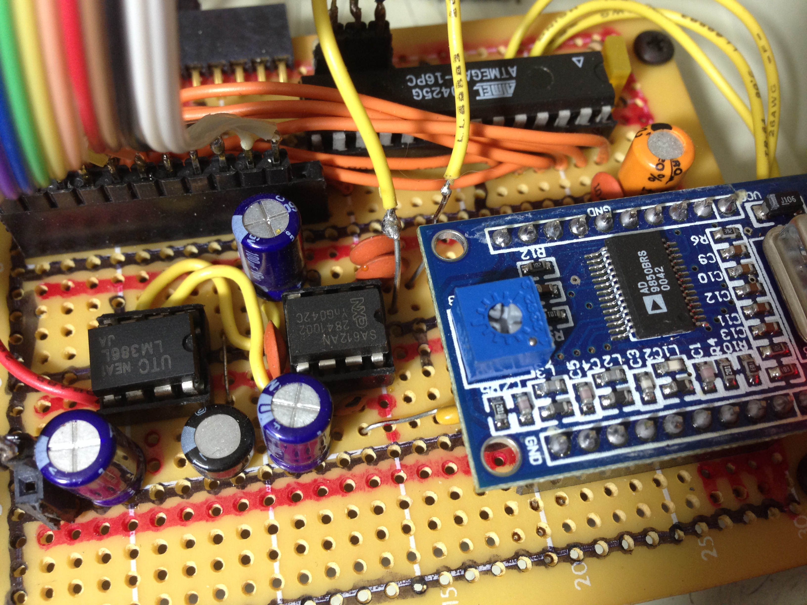
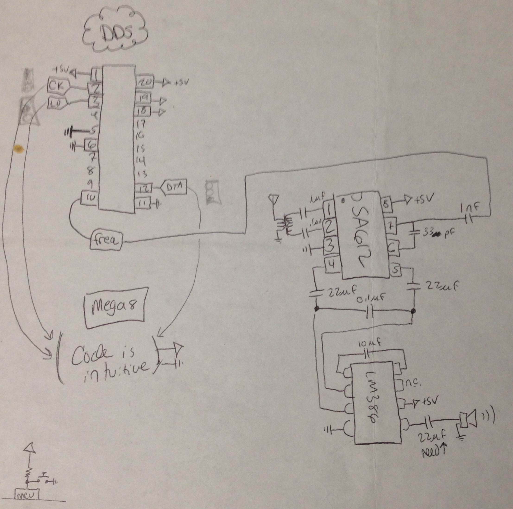

# Full Coverage Radio Receiver (old version)
This folder is a collection of resources related to the build of a full-coverage direct-conversion radio receiver I built with an AD9850 (direct digital synthesizer, DDS), ATMega8 (microcontroller), and SA612 (gilbert cell mixer), and LM386 (audio amplifier). 
* Video 1: https://www.youtube.com/watch?v=yQBfgflnZH8
* Video 2: https://www.youtube.com/watch?v=UTdNYhvF_dw

After a bunch of emails asking about this project, I found the original device (several years later) and tore it down to photograph it. I also found some paper schematics which seemed relevant.

