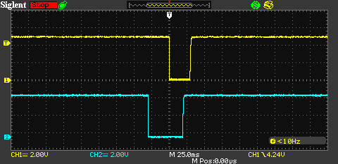
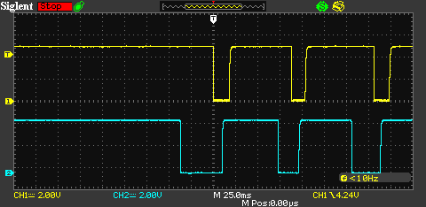
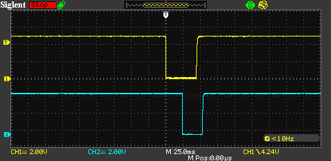
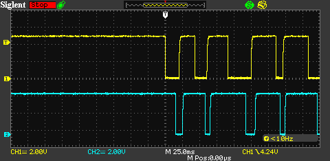
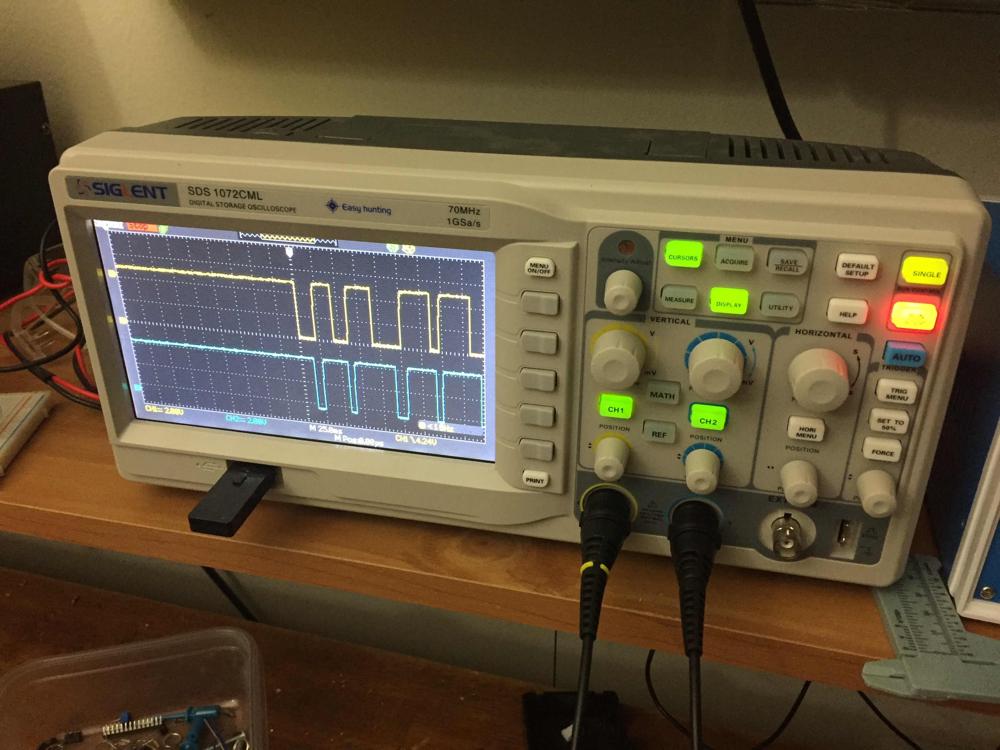
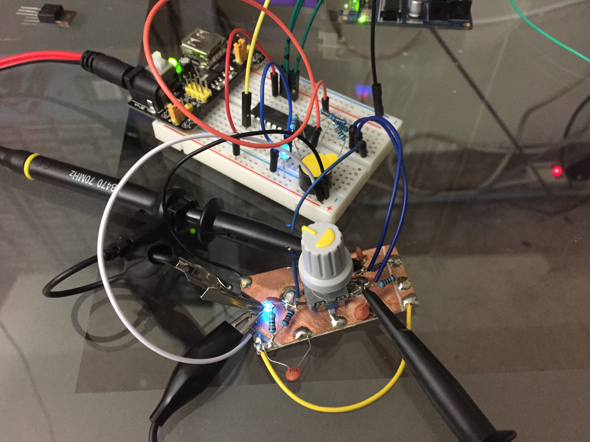
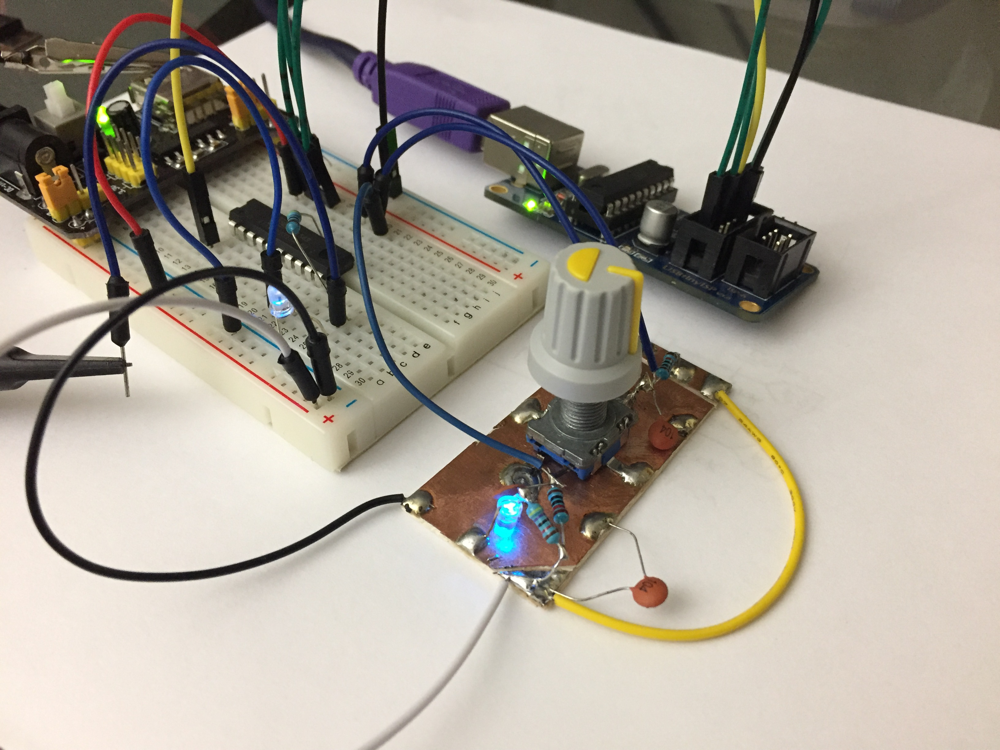
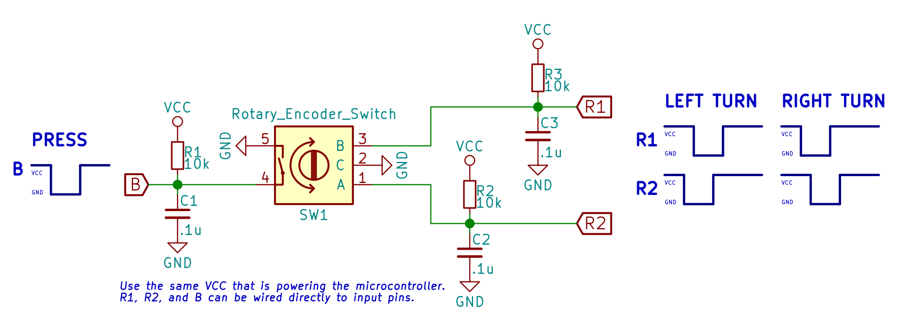

# rotary encoder
Barebones code to get up and running with a rotary encoder (outputting graycode) to a microcontroller. Although this is written for an ATTiny2313 AVR, it could work with any ATMEL AVR, Arduino, Pic, etc.

turn to the left once|
---|---
spin to the left a lot|
turn to the right once|
spin to the right a lot|

|
---|---
|
