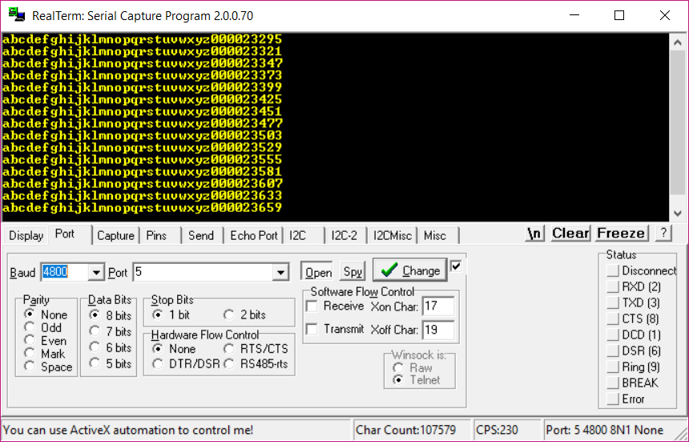

# Serial TX (USART) on an ATTiny2313 (ATTiny2313A)
Simple-case example how to get the AVR to send some data to a PC (in my case, via a FT232 breakout board / USB serial port). See [main.c](main.c) for full code. _Tip: don't forget to set and ensure your F_CPU is accurate, as UBRR depends on it._

###Determining UBRR
```C
#define USART_BAUDRATE 4800
#define UBRR_VALUE (((F_CPU/(USART_BAUDRATE*16UL)))-1)
```
###Initializing USART (TX only)
```C
void serial_init(){
	// initialize USART
	UBRRL = UBRR_VALUE & 255; 
	UBRRH = UBRR_VALUE >> 8;
	UCSRB = (1 << TXEN); // fire-up USART
	UCSRC = (1 << UCSZ1) | (1 << UCSZ0); // fire-up USART
}
```

###Sending Data
```C
void serial_send(unsigned char data){
	// send a single character via USART
	while(!(UCSRA&(1<<UDRE))){}; //wait while previous byte is completed
	UDR = data; // Transmit data
}
```

###Demo

