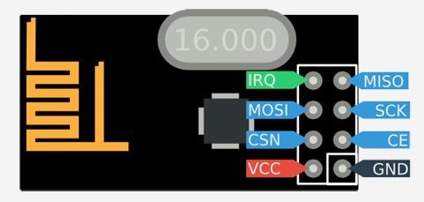

# Getting nrf24l01 / nrf24l01+ Running on ATTiny2313

## Links
* http://gizmosnack.blogspot.com/2013/04/tutorial-nrf24l01-and-avr.html
* https://github.com/antoineleclair/avr-nrf24l01
* https://github.com/kehribar/nrf24L01_plus
* https://www.insidegadgets.com/2012/08/22/using-the-nrf24l01-wireless-module/
* https://www.theengineeringprojects.com/2015/07/interfacing-arduino-nrf24l01.html
* http://arduinotehniq.blogspot.com/2016/01/nrf24l01-radio-module-and-arduino.html
* http://www.deviceplus.com/how-tos/arduino-guide/nrf24l01-rf-module-tutorial/
* http://forum.arduino.cc/index.php?topic=290701.0