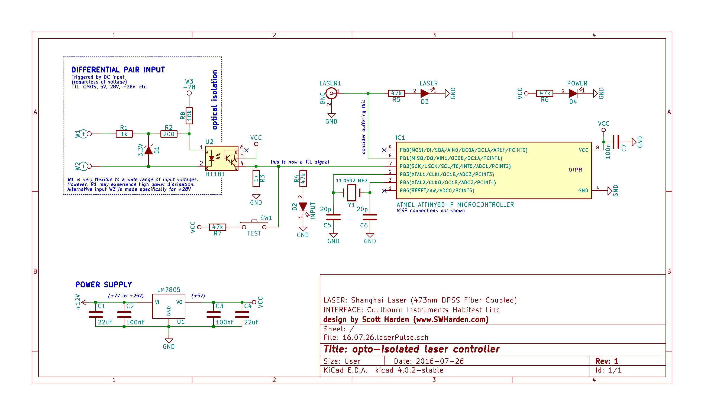

# ATTiny85 Laser Controller

Wait until an input is high. When the input is high, continuously produce 20ms pulses at 15 Hz.

* burn.cmd loads the program. 
* fuse.cmd script sets the fuses appropraitely.

Details are on the project page:
http://www.swharden.com/wp/2016-07-28-opto-isolated-laser-controller-build/

