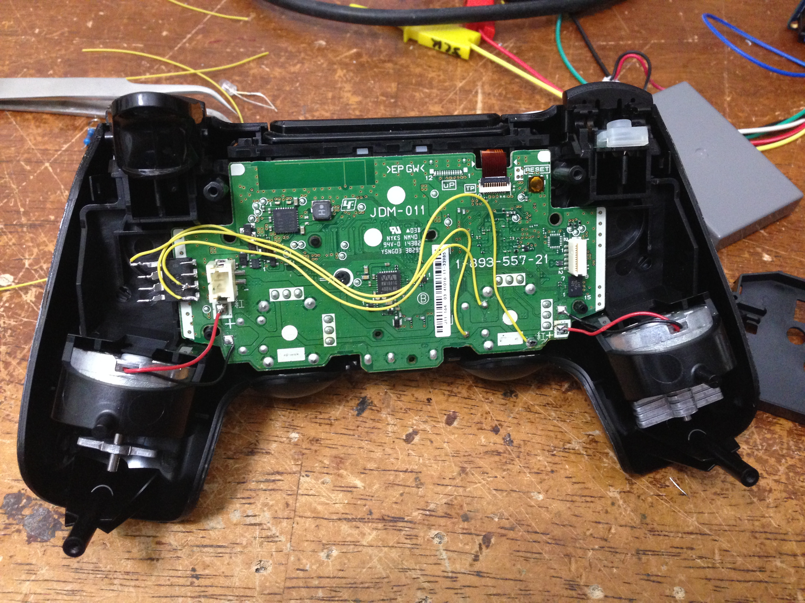
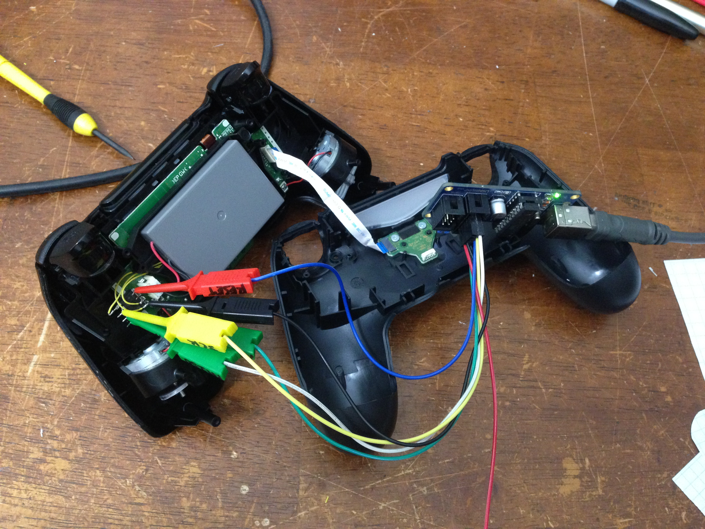

# ATTiny85 Dualshock 4 PS4 Controller Auto-Sprint
I like auto-sprint (where running forward automatically engages sprinting, usually acheived by clicking L3) but games like Call of Duty WWII (Beta) don't support it. Here I add an ATTiny85 inside the PS4 controller to continuously click L3 for me. It toggles on and off by _manually_ clicking L3. For project details, see the project webpage: https://www.swharden.com/wp/2017-09-02-ps4-controller-hack-adding-auto-run

