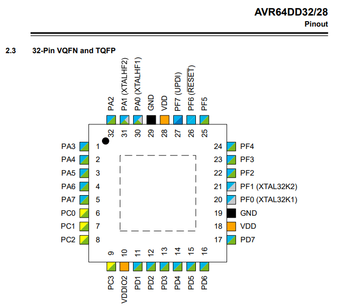

# AVR64DD32 

[AVR64DD32 datasheet](https://www.mouser.com/datasheet/2/268/AVR64DD32_28_Prelim_DataSheet_DS40002315B-2950084.pdf)

<a href="avr64dd32-pinout.png"></a>

## LED Blink

```c
#define F_CPU 24000000UL
#include <avr/io.h>
#include <avr/interrupt.h>
#include <util/delay.h>

int main(void)
{
	CCP = CCP_IOREG_gc; // Protected write
	CLKCTRL.OSCHFCTRLA = CLKCTRL_FRQSEL_24M_gc; // Set clock to 24MHz
	
	PORTD.DIR = 0xFF;

	while (1)
	{
		_delay_ms(500);
		PORTD.OUT = 255;
		_delay_ms(500);
		PORTD.OUT = 0;
	}
}
```

## TCB0 16-bit counter

```c
// Setup TCB to interrupt periodically
TCB0.CTRLA |= TCB_CLKSEL_DIV2_gc; // use peripheral clock / 2
TCB0.INTCTRL |= TCB_CAPT_bm;
TCB0.CCMP = 60000;
TCB0.CTRLA |= TCB_ENABLE_bm; // start the counter

ISR(TCB0_INT_vect)
{
	TCB0.INTFLAGS = TCB_OVF_bm | TCB_CAPT_bm;
}
```

## TCD0 16-bit counter - async count EXTCLK

```c
// Enable the highest frequency external clock on pin 30
CCP = CCP_IOREG_gc;
CLKCTRL.XOSCHFCTRLA = CLKCTRL_FRQRANGE_32M_gc| CLKCTRL_SELHF_bm | CLKCTRL_ENABLE_bm;

// Setup TCD to count the external clock
TCD0.CMPBCLR = 0x0FFF; // count to max
TCD0.CTRLA = TCD_CLKSEL_EXTCLK_gc;
TCD0.INTCTRL = TCD_OVF_bm; // Enable overflow interrupt
while (!(TCD0.STATUS & 0x01)); // ENRDY
TCD0.CTRLA |= TCD_ENABLE_bm; // EXTCLK, enable

ISR(TCD0_OVF_vect)
{
	TCD0.INTFLAGS = TCD_OVF_bm;
}

// Read the count like this
TCD0.CTRLE = TCD_SCAPTUREA_bm;
while ((TCD0.STATUS & TCD_CMDRDY_bm) == 0);
uint16_t count = TCD0.CAPTUREA;
```

## RTC

```c
// Enable the RTC
CCP = CCP_IOREG_gc;
CLKCTRL.XOSC32KCTRLA = CLKCTRL_SEL_bm | CLKCTRL_ENABLE_bm; // External clock on the XTAL32K1 pin, enable

// Setup the RTC at 10 MHz to interrupt periodically 
// 28.704 MHz with 256 prescaler is 112,125 ticks/sec
RTC.CTRLA = RTC_PRESCALER_DIV256_gc | RTC_RTCEN_bm;
RTC.INTCTRL = RTC_OVF_bm; // interrupt on overflow
RTC.CLKSEL = RTC_CLKSEL_XTAL32K_gc; // clock in XOSC23K pin
RTC.PER = 22425; // set period for 5 overflows per second

ISR(RTC_CNT_vect){
	RTC.INTFLAGS = RTC_OVF_bm;
}
```

## ADC

```c
/* Define the voltage reference (datasheet 21.5.1) */
VREF.ADC0REF = VREF_ALWAYSON_bm | VREF_REFSEL_VDD_gc; // VDD

/* Configure the pin so analog voltage can be read */
PORTA.PIN3CTRL &= ~PORT_ISC_gm;
PORTA.PIN3CTRL |= PORT_ISC_INPUT_DISABLE_gc;
PORTA.PIN3CTRL &= ~PORT_PULLUPEN_bm;

/* Setup the ADC */
ADC0.CTRLA = ADC_FREERUN_bm | ADC_ENABLE_bm; // free-running 12-bit ADC
ADC0.CTRLC = ADC_PRESC_DIV4_gc; // why?
ADC0.MUXPOS  = ADC_MUXPOS_AIN21_gc; // pin 25
ADC0.COMMAND = ADC_STCONV_bm; // start conversions

/* Perform a reading */
uint8_t reading = ADC0.RES;
```