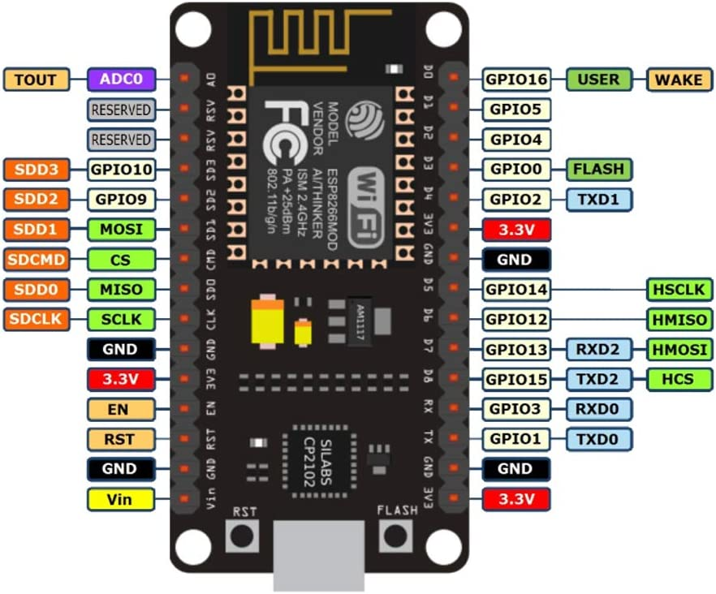

# ESP8266 Notes



## WiFi Connection

```cpp
#include <ESP8266WiFi.h>

const char* ssid = "my_ssid";
const char* password = "my_secret_password";

void setup() {
  Serial.begin(115200);
  delay(10);

  Serial.println();
  Serial.print("Connecting to ");
  Serial.println(ssid);

  WiFi.begin(ssid, password);

  while (WiFi.status() != WL_CONNECTED) {
    delay(500);
    Serial.print(".");
  }

  Serial.println("");
  Serial.println("WiFi connected");
  Serial.println("IP address: ");
  Serial.println(WiFi.localIP());
}
```

## HTTPS Request
```cpp
const char* host = "swharden.com";
const char* endpoint = "/iot/test/write/";

void make_request() {

  WiFiClientSecure client;
  client.setInsecure(); // WARNING: HTTP security disabled

  if (!client.connect(host, 443)) {
    Serial.println("ERROR: connection failed");
    return;
  }

  String url = String(endpoint) + "?data=123";
  String request = "GET " + url + " HTTP/1.1\r\n" + "Host: " + host + "\r\n" + "Connection: close\r\n\r\n";
  client.print(request);
}
```