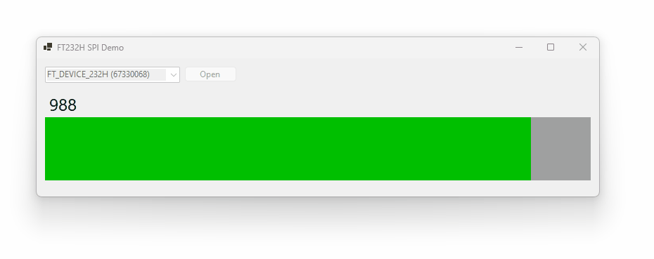
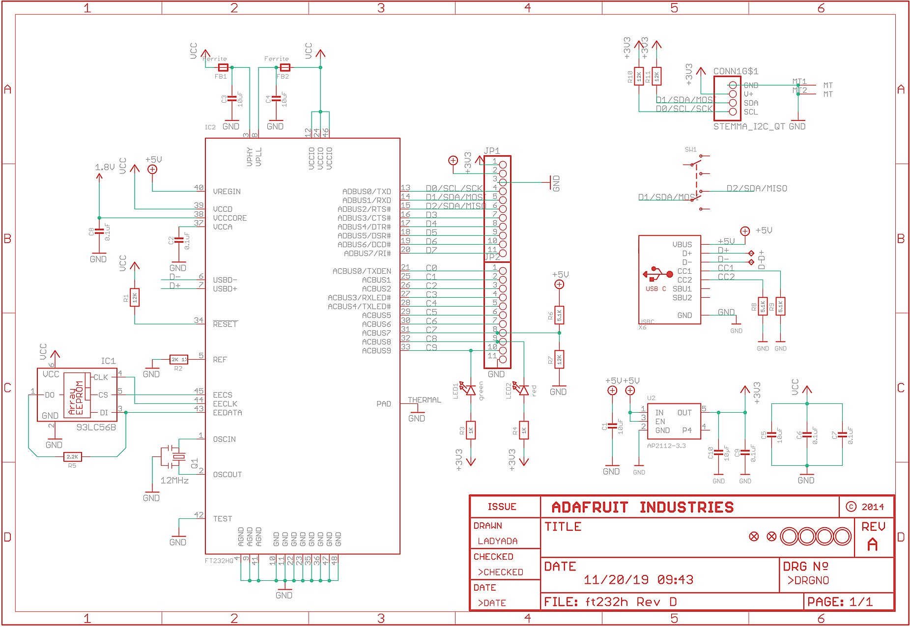

# FT232H SPI C# Quickstart

This project demonstrates how to use C# to directly interface a [FT232H](https://ftdichip.com/wp-content/uploads/2020/07/DS_FT232H.pdf) and read ADC values from a [MCP3201](http://ww1.microchip.com/downloads/en/devicedoc/21290f.pdf) over SPI.

## Setup

I used a [Adafruit FT232H breakout board](https://www.adafruit.com/product/2264) and wired it accordingly

* D0 - Clock
* D1 - SDA/MOSI (NC)
* D2 - SDA/MISO
* D3 - CS

