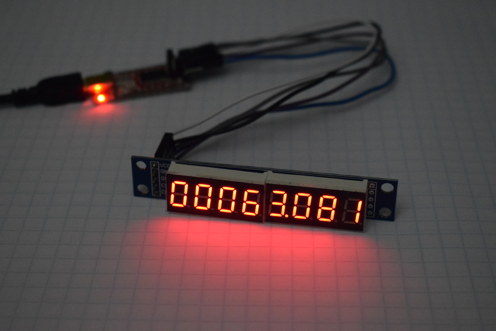
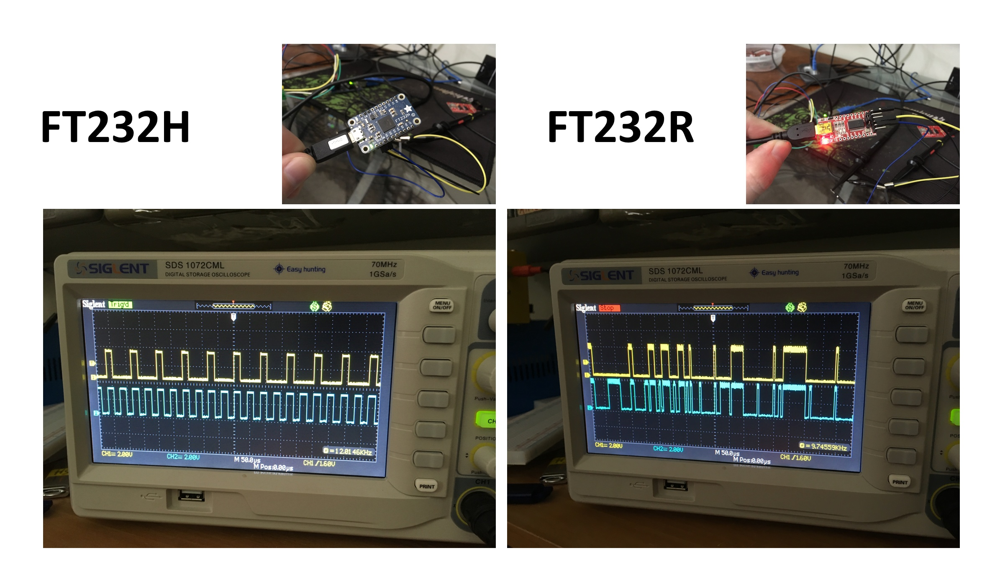

# Bit-bang SPI with FTDI (FT232R/FT232H)

FTDI USB/Serial devices can be bit-banged to drive SPI devices. Here code (C#) is provided which is tested/working do drive a SPI 7-segment display (based around a MAX7219 LED driver).

## FT232R Timing / Jitter is TERRIBLE
SPI works, but wow it looks bad. For time-critical applications use the FT232H.

