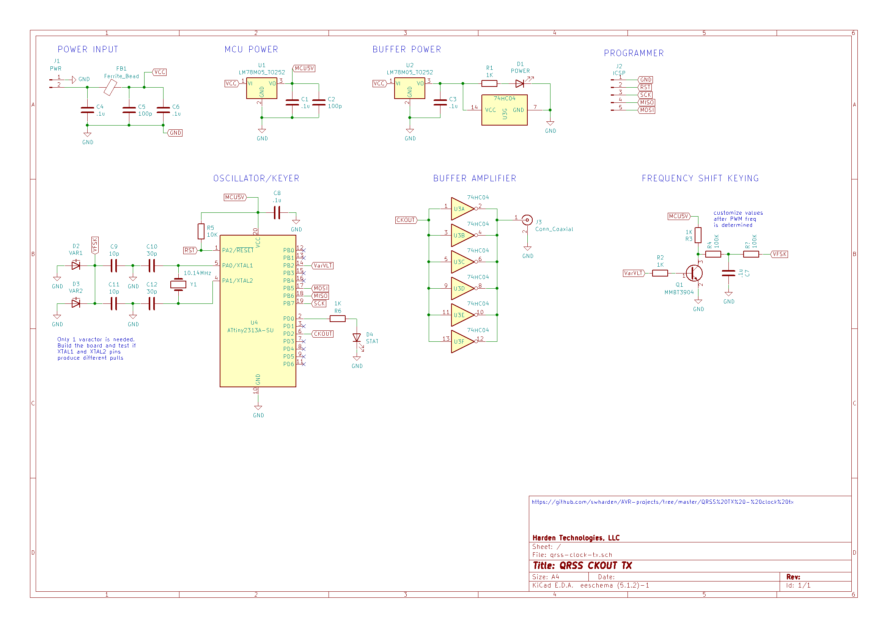

# QRSS TX - CKOUT Transmitter

This project explores an oddball QRSS transmitter design. 

* A microcontroller will use an external crystal oscillator. 
* A fuse will be set to enable 5V square wave output on CKOUT pin
* The CKOUT signal will be buffered with a line driver
* The frequency can be adjusted with a voltage applied to a varactor

# Components
* [10.140 MHz crystal](https://www.mouser.com/ProductDetail/IQD/LFXTAL013480Bulk?qs=e4%2FAndAAwgLefIQQ1kDEyw%3D%3D) ($0.75)
* [ATTiny2313](https://www.mouser.com/ProductDetail/Microchip-Technology-Atmel/ATTINY2313A-SU?qs=sGAEpiMZZMvqv2n3s2xjsRLJ5ROJ0gc0dZSXrqbzGMo%3D) SOIC-20 ($1.12)
* [74HC04](https://www.mouser.com/ProductDetail/Toshiba/74HC04DBJ?qs=sGAEpiMZZMutVWjHE%2FYQw9wp2KmMZae1rDJE3jT16hQ%3D) SOIC-14 ($0.40)
  * 6 inverting gates
  * 6V max operating voltage
  * 25mA max output current (6x = 150mA)
  * 500mW max total power output
* [74HC240 (8 gates)](https://www.mouser.com/ProductDetail/ON-Semiconductor/MC74HC240ADWR2G?qs=sGAEpiMZZMtOwpHsRTkso1w2FFrRgZoC7Sba8mWwszY%3D) SOIC-20 ($0.58)
  * 8 inverting gates
  * 6V max operating voltage
  * 35mA max output current (8x = 280mA)
  * 450mW max total power output
* [7805 regulator (1A)](https://www.mouser.com/ProductDetail/ON-Semiconductor/MC7805CDTRKG?qs=sGAEpiMZZMtUqDgmOWBjgFMGuATcbJe5wWS0hbY0mRQ%3D) DPAK-3 ($0.56)
* [SMA connector](https://www.mouser.com/ProductDetail/LPRS/SMA-CONNECTOR?qs=sGAEpiMZZMuLQf%252BEuFsOrkd7M7rmHNHidLMZ%2Ftb%252B0T1YCJLScw0qLA%3D%3D) ($1.08)
* varactor - use an 0805 LED for now

# Resources
* [What is QRSS?](https://www.qsl.net/m0ayf/What-is-QRSS.html)
* [Genesis Q5 transmitter](http://www.genesisradio.com.au/Q5/) uses a 74HC04N as an oscillator and also to buffer and amplify the output.
* [Using 74HC240 as a buffer amplifier](http://py2ohh.w2c.com.br/trx/digital/rfdigital.htm)
