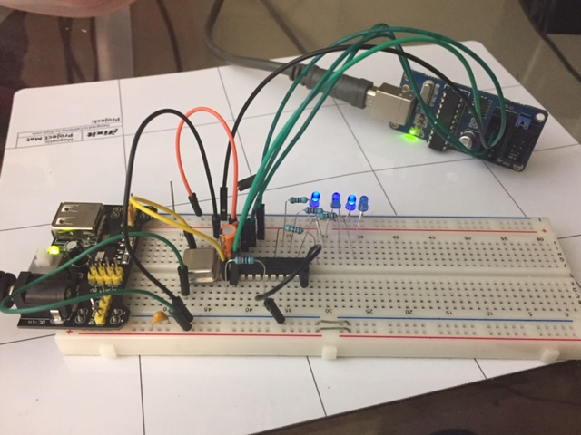

# AVR-projects
This repository contains a growing collection of individual AVR project files for various tasks. I personally use these projects as starting points for new microcontroller projects, or reference for common procedudures I usually have to go back to the datasheet for (timers, counters, frequency counting or synthesis, interrupts, UART, I2C, etc)

# Programming Setup
I almost always use AVRISPmkII and AVRdude. I virtually never use AVRStudio.

Note|Picture
---|---
AVRISPmkII is a ceap, fast, and convenient AVR programmer. | 
Bus Pirate _technically_ can program AVRs, but it's so slow it's not practical. [Here's a post](http://www.swharden.com/wp/2016-07-14-controlling-bus-pirate-with-python) I wrote about it. I like the bus pirate when I need to use software to measure voltages and toggle pins. It's slow though, because the handshake it bit-banged and it takes tens of seconds to program an AVR. For just programming, I prefer an (ebay knockoff) AVR ISP mkII. Definately check out AVRDudess as a GUI for AVRDude. I usually get a standard command for a project and put it in a batch file in the same folder.| 
AVRDudess can simplify programming of code and fuses. | 

## Software
* Just install [WinAVR] (https://sourceforge.net/projects/winavr/files/) and it should install drivers for common programmers.
* definately check out [AVRDudess] (http://blog.zakkemble.co.uk/avrdudess-a-gui-for-avrdude/) (a GUI for AVRdude) as an easy GUI to load flash onto chips

## AVR-ISP
* [AVR Programming in 64-bit Windows 7] (http://www.swharden.com/wp/2013-05-07-avr-programming-in-64-bit-windows-7/) (should also work for windows 10)
* windows 10 driver for USBTiny is [here] (https://learn.adafruit.com/usbtinyisp/drivers)
* actually I only got it to work after installing [Zadig] (http://zadig.akeo.ie/)

## Common AVR Datasheets and Pinouts

chip|pinout|datasheets
---|---|---
ATMega328||[[summary](http://www.atmel.com/Images/Atmel-42735-8-bit-AVR-Microcontroller-ATmega328-328P_Summary.pdf)] [[complete](http://www.atmel.com/Images/Atmel-42735-8-bit-AVR-Microcontroller-ATmega328-328P_Datasheet.pdf)]
ATMega2313||[[summary](http://www.atmel.com/Images/8246S.pdf)] [[complete](http://www.atmel.com/Images/doc8246.pdf)]|
ATTiny45||[[summary](http://www.atmel.com/Images/Atmel-2586-AVR-8-bit-Microcontroller-ATtiny25-ATtiny45-ATtiny85_Datasheet-Summary.pdf)] [[complete](http://www.atmel.com/Images/Atmel-2586-AVR-8-bit-Microcontroller-ATtiny25-ATtiny45-ATtiny85_Datasheet.pdf)]|

# Helpful Links
* [AVR fuse calculator] (http://www.engbedded.com/fusecalc)
* [AVR timer calculator] (http://eleccelerator.com/avr-timer-calculator/)

## Misc Code

### Reading pins
```C
if(PIND&(1<<PD7)){doSomething();} // runs doSomething() if PD7 is HIGH
```

### Bit flipping in C
```c
PORTD|=(1<<PD6); // sets PD6 high
PORTD&=~(1<<PD6); // sets PD6 low
PORTD^=(1<<PD6); // flips the state of PD6
```
