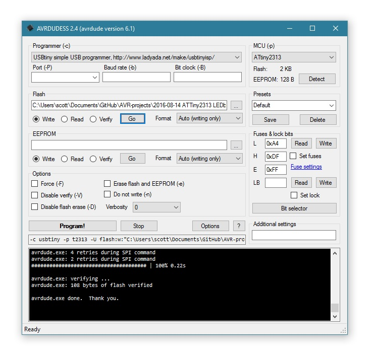
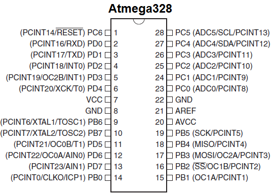
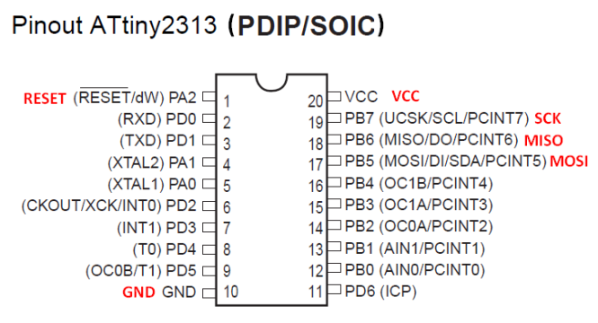
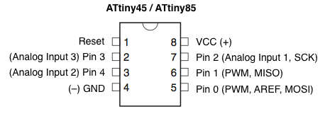

# AVR-projects
This repository contains a growing collection of individual AVR project files for various tasks. I personally use these projects as starting points for new microcontroller projects, or reference for common procedudures I would otherwise have to go back to the datasheet for (timers, counters, frequency counting or synthesis, interrupts, UART, I2C, ADC, etc). Each folder is self-contained and has batch scripts to set fuses to change the clock source (internal RC oscillator at 8MHz, div/8 for 1MHz, or external crystal typically up to 20 MHz)

**These are some of my favorites:**
> 
- Blink an LED with an [ATTiny45](/ATMega328%20%20LEDblink), [ATTiny2313](ATTiny2313%20%20LEDblink), or [ATMega328](ATMega328%20%20LEDblink)
- sending data from a microcontroller to a PC with USART (likely via USB serial port)
  - [USART for ATTiny2313](ATTiny2313%202017-02-05%20serial%20USART)
  - [ATMega328 wired](ATMega328%202015-01-01%20USART%20serial) or [over bluetooth](ATMega328%202016-09-15%20CVM)
  - [interrupt driven](ATMega328%202015-01-01%20USART%20serial/tx%20rx%20interrupt) vs. [polling method](ATMega328%202015-01-01%20USART%20serial/tx%20rx%20polling) for USART input
- [PWM for ATTiny2313](ATTiny2313%202017-02-01%20PWM) or [PWM for ATTiny85](ATTiny85%202016-12-30%20PWM)
- code to [interface with a rotary encoder](ATTiny2313%202017-02-02%20rotary%20encoder)
- ultra minimal [frequency generator](ATTiny85%202016-07-31%20frequency%20generator) I use for all sorts of stuff
- code to [read ADC values and send them over serial](ATMega328%202017-02-07%20ADC%20serial%20LM35) with ATMega328 (including code for ADC noise reduction mode)

# Programming Setup
I almost always use AVRISPmkII and AVRdude (launched from a batch script) to program my chips. I virtually never use AVRStudio. I typically develop in a Windows environment, but the code (and AVRdude) works the same in Linux.

### Software
* Just install [WinAVR](https://sourceforge.net/projects/winavr/files/) and it should install drivers for common programmers.
* I prefer to edit C code in [Notepad++](https://notepad-plus-plus.org/)
* definately check out [AVRDudess](http://blog.zakkemble.co.uk/avrdudess-a-gui-for-avrdude/) (a GUI for AVRdude) as an easy GUI to load flash onto chips

### Hardware
* [AVR Programming in 64-bit Windows 7](http://www.swharden.com/wp/2013-05-07-avr-programming-in-64-bit-windows-7/) (should also work for windows 10)
* windows 10 driver for USBTiny is [here](https://learn.adafruit.com/usbtinyisp/drivers)
* actually I only got it to work after installing [Zadig](http://zadig.akeo.ie/)

### Programmers
Note|Picture
---|---
AVRISPmkII is a ceap, fast, and convenient AVR programmer. | 
Bus Pirate _technically_ can program AVRs, but it's so slow it's not practical. [Here's a post](http://www.swharden.com/wp/2016-07-14-controlling-bus-pirate-with-python) I wrote about it. I like the bus pirate when I need to use software to measure voltages and toggle pins. It's slow though, because the handshake it bit-banged and it takes tens of seconds to program an AVR. For just programming, I prefer an (ebay knockoff) AVR ISP mkII. Definately check out AVRDudess as a GUI for AVRDude. I usually get a standard command for a project and put it in a batch file in the same folder.| 
AVRDudess can simplify programming of code and fuses. | 


## Common AVR Datasheets and Pinouts

chip|pinout|datasheets
---|---|---
**ATMega328**||[[summary](http://www.atmel.com/Images/Atmel-42735-8-bit-AVR-Microcontroller-ATmega328-328P_Summary.pdf)] [[complete](http://www.atmel.com/Images/Atmel-42735-8-bit-AVR-Microcontroller-ATmega328-328P_Datasheet.pdf)]
**ATMega2313**||[[summary](http://www.atmel.com/Images/8246S.pdf)] [[complete](http://www.atmel.com/Images/doc8246.pdf)]|
**ATTiny45**||[[summary](http://www.atmel.com/Images/Atmel-2586-AVR-8-bit-Microcontroller-ATtiny25-ATtiny45-ATtiny85_Datasheet-Summary.pdf)] [[complete](http://www.atmel.com/Images/Atmel-2586-AVR-8-bit-Microcontroller-ATtiny25-ATtiny45-ATtiny85_Datasheet.pdf)]|<img width="300" src="resources/ATMega328.png)

# Helpful Links
* [AVR fuse calculator](http://www.engbedded.com/fusecalc)
* [AVR timer calculator](http://eleccelerator.com/avr-timer-calculator/)

## Misc Code

### Reading pins
```C
if(PIND&(1<<PD7)){doSomething();} // runs doSomething() if PD7 is HIGH
```

### Bit flipping in C
```c
PORTD|=(1<<PD6); // sets PD6 high
PORTD&=~(1<<PD6); // sets PD6 low
PORTD^=(1<<PD6); // flips the state of PD6
```
