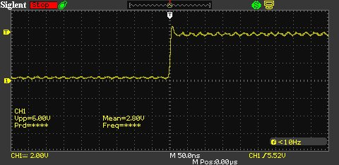
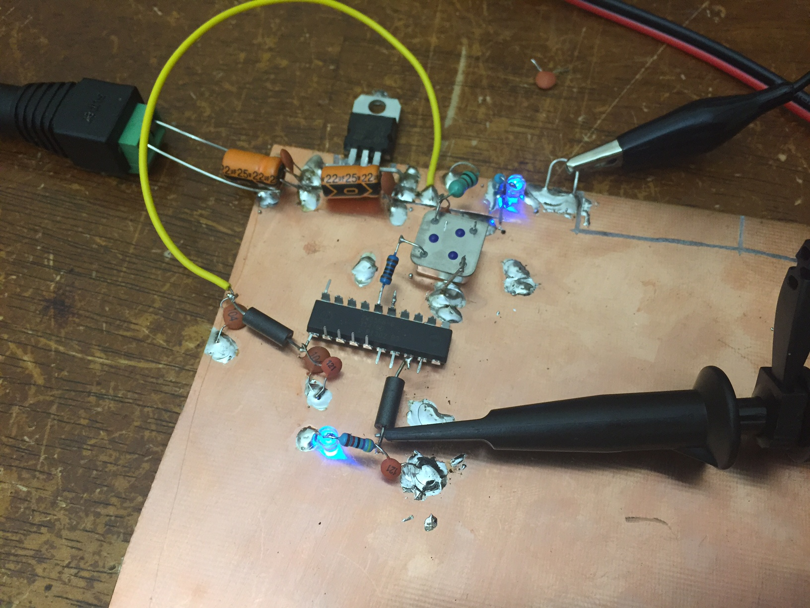
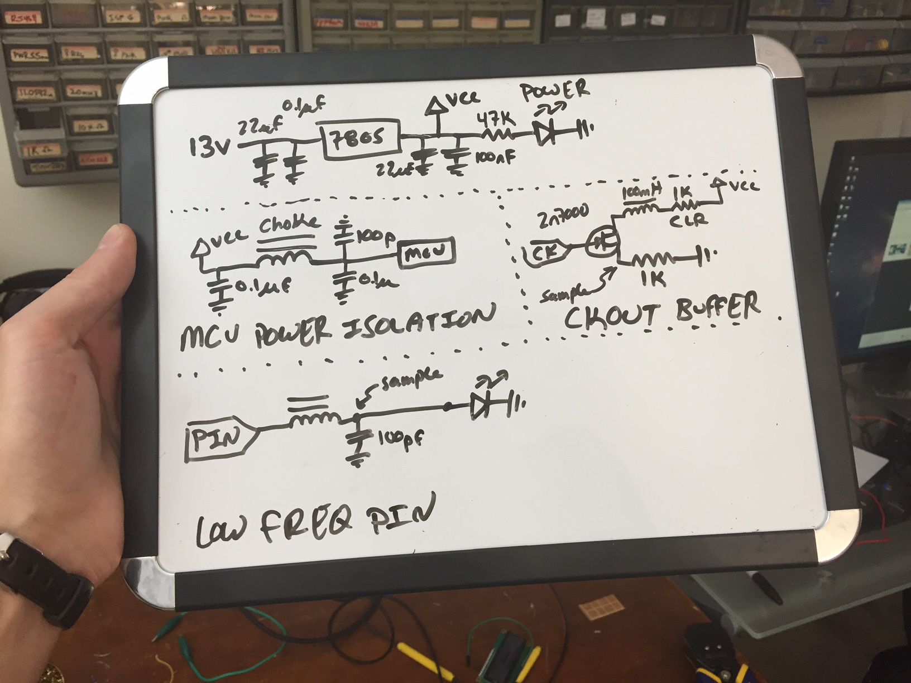

# AVR pin noise
Sometimes I like to enable CKOUT (by setting a fuse). When I do this, I put ripples in the output current of all my other pins as well as the power supply. I practiced today building different circuits until I got one that's a good go-to for me. It lets me both isolate and buffer high frequency CKOUT signals while maintaining pure signals from slower changing pins.

