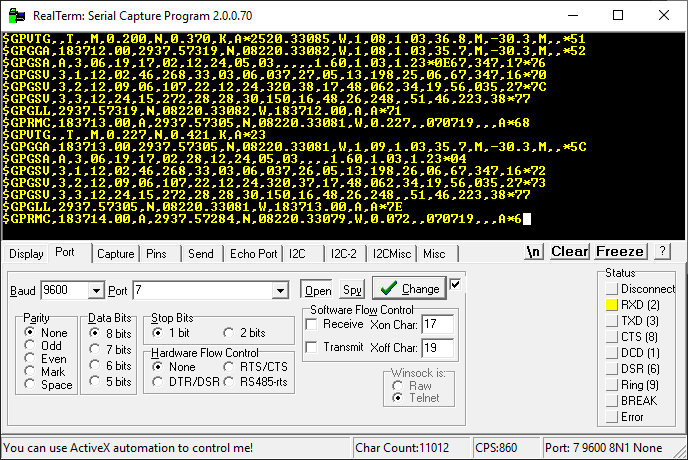

# uBlox Neo-6M GPS Module
* Power with 3.3V! Not 5V!

## Serial Data
A block of data comes in at 1Hz



### Message Components
See the [NMEA spec](https://www.gpsinformation.org/dale/nmea.htm) for full details

code | description
---|---
`$GPRMC`| position, velocity, and time
`$GPVTG`| velocity details
`$GPGGA`| 3D location and GPS fix details
`$GPGSA`| satellite fix details
`$GPGSV`| details for every satellite in view
`$GPGLL`| latitude, longitude, and time

### Sample Message

```
$GPRMC,184130.00,A,2937.57080,N,08220.33445,W,0.049,,070719,,,D*65
$GPVTG,,T,,M,0.049,N,0.092,K,D*20
$GPGGA,184130.00,2937.57080,N,08220.33445,W,2,09,1.17,15.3,M,-30.3,M,,0000*5E
$GPGSA,A,3,06,19,17,02,51,28,12,24,05,,,,2.23,1.17,1.90*0A
$GPGSV,3,1,12,02,47,270,33,03,05,036,26,05,15,198,32,06,66,351,30*79
$GPGSV,3,2,12,09,07,106,23,12,26,319,30,17,48,065,33,19,56,038,25*72
$GPGSV,3,3,12,24,14,270,21,28,28,151,15,48,26,248,,51,46,223,37*79
$GPGLL,2937.57080,N,08220.33445,W,184130.00,A,D*79
```

**Location format:** `DDMM.MMMMM`  where `D` is degrees and `M` is minutes.

`2937.57080,N,08220.33445,W` becomes:

`29 37.57080N, 082 20.33445 W`

(this format works with Google Maps)

## Resources
* Jitter is officially documented in the [timing application note](https://www.u-blox.com/sites/default/files/products/documents/Timing_AppNote_%28GPS.G6-X-11007%29.pdf)
* [NMEA format specification](https://www.gpsinformation.org/dale/nmea.htm)

## Official Software

u-Center: https://www.u-blox.com/en/product/u-center


To modify the functionality of your module: View->Messages View

I was able to change the frequency of the PPS signal this way, but it resets to the default (1PPS) when the module is rebooted.

